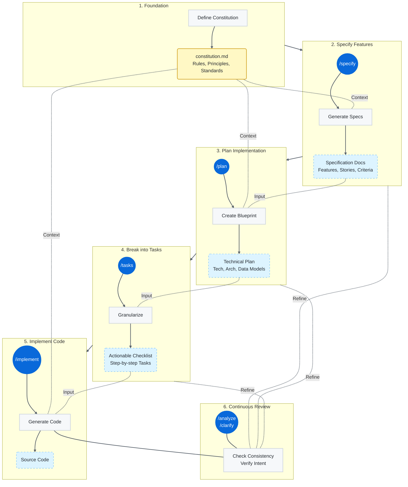

ขั้นตอนการพัฒนาซอฟต์แวร์ตามแนวทาง Spec-driven Development ด้วย GitHub Spec Kit และ Copilot

```mermaid
graph TD
    %% --- Styling ---
    classDef phase fill:#f6f8fa,stroke:#d0d7de,stroke-width:2px,color:#24292f;
    classDef action fill:#0969da,stroke:#0969da,stroke-width:2px,color:#ffffff,rx:5,ry:5;
    classDef artifact fill:#ddf4ff,stroke:#54aeff,stroke-width:1px,stroke-dasharray: 5 5,color:#24292f;
    classDef context fill:#fff8c5,stroke:#d4a72c,stroke-width:2px,color:#24292f;

    %% --- Nodes & Structure ---

    %% Stage 1: Constitution
    subgraph Stage1 [1. Foundation]
        direction TB
        ConstNode[Define Constitution]:::phase
        ConstFile(constitution.md<br/>Rules, Principles, Standards):::context
        ConstNode --> ConstFile
    end

    %% Stage 2: Specify
    subgraph Stage2 [2. Specify Features]
        direction TB
        CmdSpecify(("/specify")):::action
        SpecNode[Generate Specs]:::phase
        SpecArtifact(Specification Docs<br/>Features, Stories, Criteria):::artifact
        
        CmdSpecify --> SpecNode
        SpecNode --> SpecArtifact
    end

    %% Stage 3: Plan
    subgraph Stage3 [3. Plan Implementation]
        direction TB
        CmdPlan(("/plan")):::action
        PlanNode[Create Blueprint]:::phase
        PlanArtifact(Technical Plan<br/>Tech, Arch, Data Models):::artifact
        
        CmdPlan --> PlanNode
        PlanNode --> PlanArtifact
    end

    %% Stage 4: Break into Tasks
    subgraph Stage4 [4. Break into Tasks]
        direction TB
        CmdTasks(("/tasks")):::action
        TaskNode[Granularize]:::phase
        TaskArtifact(Actionable Checklist<br/>Step-by-step Tasks):::artifact
        
        CmdTasks --> TaskNode
        TaskNode --> TaskArtifact
    end

    %% Stage 5: Implementation
    subgraph Stage5 [5. Implement Code]
        direction TB
        CmdImpl(("/implement")):::action
        ImplNode[Generate Code]:::phase
        CodeBase(Source Code):::artifact
        
        CmdImpl --> ImplNode
        ImplNode --> CodeBase
    end

    %% Stage 6: Analyze & Clarify (Floating Tool)
    subgraph Stage6 [6. Continuous Review]
        direction TB
        CmdReview(("/analyze<br/>/clarify")):::action
        ReviewNode[Check Consistency<br/>Verify Intent]:::phase
        CmdReview --- ReviewNode
    end

    %% --- Flow & Dependencies ---

    %% Main Process Flow
    Stage1 --> Stage2
    Stage2 --> Stage3
    Stage3 --> Stage4
    Stage4 --> Stage5

    %% Contextual Data Flow (The "Brain" of the operation)
    ConstFile -.-|Context| SpecNode
    ConstFile -.-|Context| PlanNode
    ConstFile -.-|Context| ImplNode
    
    SpecArtifact -.-|Input| PlanNode
    PlanArtifact -.-|Input| TaskNode
    TaskArtifact -.-|Input| ImplNode
    
    %% Review Loops (Analyze can happen anytime)
    %% Reversing direction arrows to force ReviewNode to bottom of the graph
    Stage2 <-.-|Refine| ReviewNode
    Stage3 <-.-|Refine| ReviewNode
    Stage4 <-.-|Refine| ReviewNode
    %% Anchor to bottom
    ImplNode ~~~ ReviewNode

    %% Layout adjustments
    linkStyle default stroke:#57606a,stroke-width:2px;
```