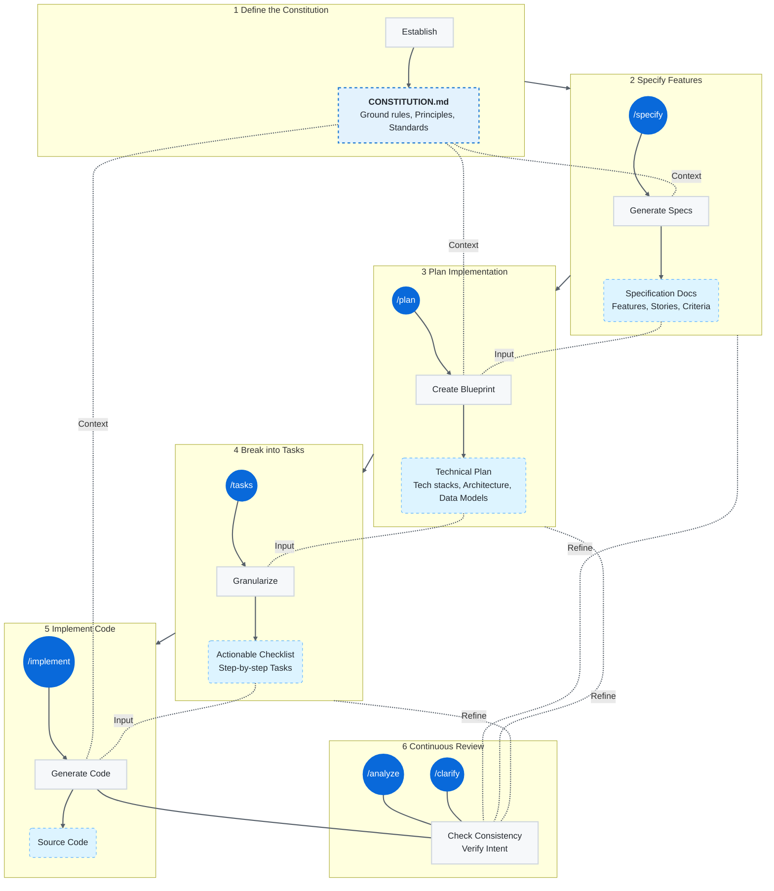

ขั้นตอนการพัฒนาซอฟต์แวร์ตามแนวทาง Spec-driven Development(SDD) ด้วย GitHub Spec Kit และ Copilot

<!--truncate-->
1. **Define the Constitution:** Establish the
  - ground rules 
  - principles 
  - standards for the entire project in a `constitution.md` file.  

This document sets constraints and context that the AI agent references throughout the process.  

2. **Specify Features:** Use the `/specify` command in Copilot Chat to define what to build:
  - features
  - user stories
  - acceptance criteria rather than how.  

The AI helps generate detailed specification documents (often in Markdown).  

3. **Plan the Implementation:** Use the `/plan` command to create a technical blueprint. The AI, using the context from the specification and constitution, generates a detailed plan including:
  - technology stacks/frameworks
  - architecture
  - data models.  

4. **Break into Tasks:** The `/tasks` command instructs the AI to break down the plan into granular, actionable steps with clear acceptance criteria. 

5. **Implement the Code:** Finally, use the `/implement` command or manually prompt Copilot Chat to generate the code for the defined tasks. The AI leverages all the previously generated documentation to provide highly contextual and accurate code suggestions.

6. **Analyze and Clarify:** The `/analyze` and `/clarify` commands can be used at any point to check for inconsistencies or missing information in the specifications, ensuring all stakeholders (human and AI) agree on the intent before implementation.