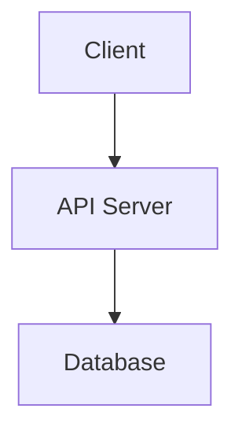
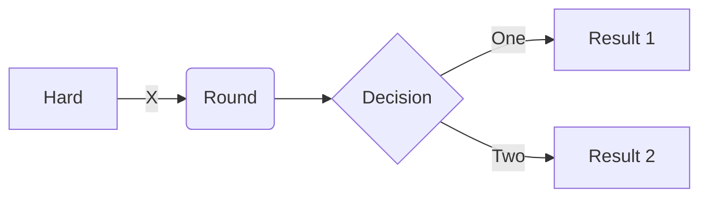
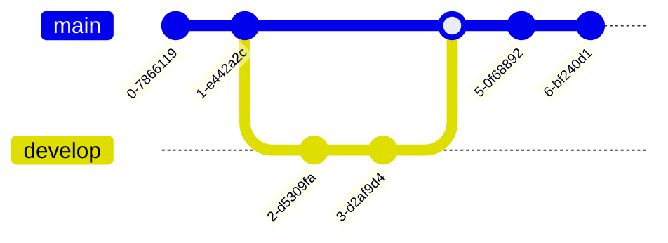
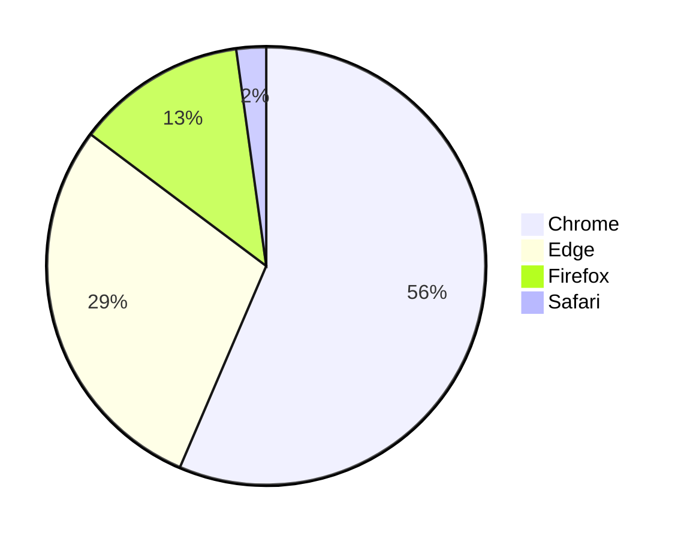

# 🧱 Visuals You Can Version, Review, and Automate
:::warning
This is AI generated content which can make mistake.
:::
In modern software development, everything is code—from infrastructure (Infrastructure as Code) to security policies. So why not diagrams?  

Welcome to the world of Diagram as Code (DaC)—an emerging practice that treats diagrams not as static images, but as living artifacts in your codebase. With tools like Diagrams, PlantUML, and Structurizr DSL, developers can generate architecture, cloud, or system diagrams programmatically.
## ✅ What is "Diagram as Code"?
“Diagram as Code” is the approach of creating diagrams using source code. Instead of using drag-and-drop interfaces like Lucidchart or draw.io, diagrams are defined using text-based scripting or DSLs (domain-specific languages). This code can be stored in version control, reviewed in pull requests, and automatically updated.

Popular tools in this space include:  
[Diagrams](https://github.com/mingrammer/diagrams) – Python-based cloud system diagram tool.  
[PlantUML](https://github.com/plantuml/plantuml) – Text-based UML and other diagram generation.  
[Structurizr DSL](https://github.com/structurizr/dsl) – Software architecture modeling with C4 model support.  
[Mermaid](https://github.com/mermaid-js/mermaid) – Markdown-like syntax for sequence, flowcharts, and more.  
[ASCII editor](https://asciiflow.com/#/) - Terminal-oriented diagraming tool
## 🚀 Why Use Diagram as Code?
1. **Version Control and History**  
Traditional diagrams are hard to track. DaC lives in your repository, so:
- Changes are traceable (via Git).
- You can review diffs in pull requests.
- Rollbacks are just a git revert away.

2. **Collaboration and Review**  
Instead of exporting an image and sending it over chat:
- Share the diagram source code.
- Review changes like any other code.
- Avoid miscommunication in large teams.

3. **Automation Friendly**  
Generate diagrams:
- As part of CI/CD pipelines.
- Automatically from infrastructure definitions.
- With consistent layout and styling.  

4. **Code-as-Single-Source-of-Truth**  
Your diagrams are always:
- Up-to-date with the architecture/codebase.
- Reproducible across environments.
- Free from outdated “PowerPoint artifacts.”

5. **Reusable and Modular**  
Just like code:
- Create reusable components.
- Template common patterns.
- Generate multiple versions (e.g., dev vs prod) from the same logic.  

## 🧩 When Should You Use DaC?
Use DaC when:

- You maintain architecture docs.
- Diagrams change frequently.
- Teams review architecture collaboratively.
- You need traceable, consistent, and auditable diagrams.
- Stick to traditional tools when:
- Quick brainstorming or whiteboarding.
- Non-technical audiences need to edit.

Diagram as Code isn't just a productivity trick—it’s a mindset shift.
It aligns documentation with DevOps practices, closes the gap between code and visuals, and brings diagrams into the world of automation and collaboration.
:::tip 
Start small. Convert one diagram. Store it in version control. Then automate it.
Soon, you’ll wonder how you ever worked any other way.
:::

## ✅ Why Use Mermaid?
1. Easy to Learn, Markdown-Friendly Syntax  
[Mermaid](https://github.com/mermaid-js/mermaid) uses a lightweight, Markdown-inspired syntax. If you're already writing documentation in Markdown (e.g., in GitHub, Notion, or MkDocs), [Mermaid](https://github.com/mermaid-js/mermaid) fits right in.

:::note Example:

:::
Compare that with more verbose UML-style syntax in PlantUML.

2. Built-in Support in Popular Tools  
[Mermaid](https://github.com/mermaid-js/mermaid) is natively supported or easily integrated with:
- GitHub → Preview diagrams in README.md
- VS Code → Mermaid Live Preview extension
- Docusaurus → for React-based docs sites
- Obsidian, Notion, MkDocs, GitLab, and others.  

This makes [Mermaid](https://github.com/mermaid-js/mermaid) perfect for developer documentation workflows.

3. Zero Installation (Web-Based)  
You can use [Mermaid Live Editor](https://mermaid.live/) or even GitHub’s built-in renderer without installing anything. No Java, no Python—just write and render.

4. Fast Iteration for Common Diagrams  
[Mermaid](https://github.com/mermaid-js/mermaid) supports:
- Flowcharts
- Sequence diagrams
- Class diagrams
- Gantt charts
- Entity-Relationship diagrams
- Pie charts
- Git graphs

You can sketch these quickly, especially for internal docs, design reviews, or explaining flows.

5. Great for Docs-as-Code Teams  
In documentation-focused teams (e.g., DevRel, DevOps, or open-source maintainers), [Mermaid](https://github.com/mermaid-js/mermaid) excels because:
- It's easy to embed in .md files.
- Non-engineers can pick it up.
- It keeps the doc process code-native.

## 🧠 When Should You Choose Mermaid?
:::info Use
[Mermaid](https://github.com/mermaid-js/mermaid) if:
- You write a lot of Markdown-based documentation.
- You want something simple and quick.
- Your diagrams live in version-controlled docs (e.g., GitHub wikis, README.md).
- You want live preview without setting up tooling.
:::
:::warning  Skip
[Mermaid](https://github.com/mermaid-js/mermaid) if:
- You need detailed software architecture modeling (→ use Structurizr DSL).
- You’re diagramming cloud infra visually (→ use Diagrams for AWS/GCP/etc.).
- You’re deep into UML (→ PlantUML may suit better).
:::

## Mermaid Diagram Examples

:::note Flowchart:

:::

:::note Git graph:

:::

:::note Pie chart:

:::

## 🏁 Final Verdict
[Mermaid](https://github.com/mermaid-js/mermaid) is the “Markdown of diagrams.”
It’s great for lightweight, maintainable visuals that live alongside your code or docs. If you're aiming for simplicity, speed, and web-native rendering, [Mermaid](https://github.com/mermaid-js/mermaid) is hard to beat.