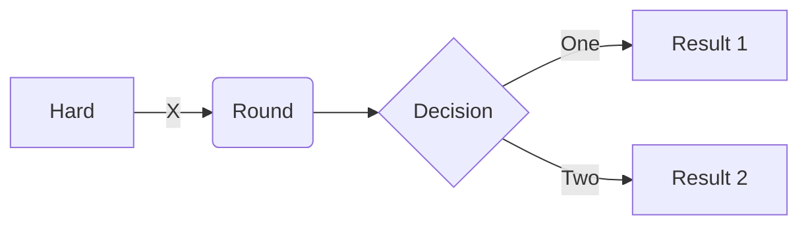
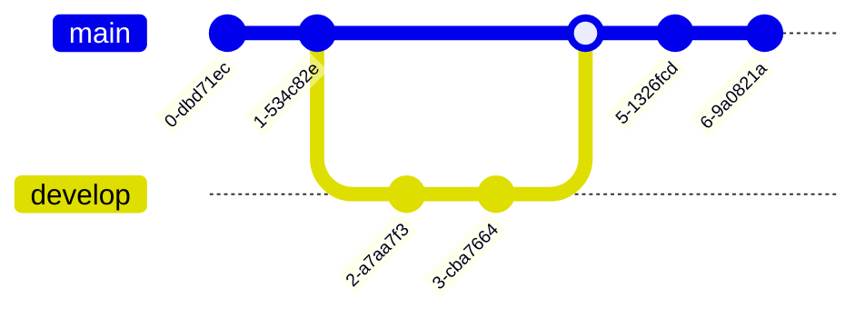
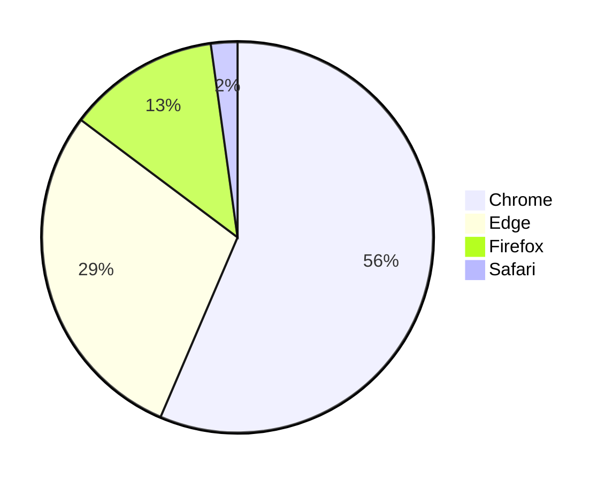

:::tip
Visit **[Mermaid official repo](https://github.com/mermaid-js/mermaid)**
:::

## Flowchart

```mermaid
flowchart LR

A[Hard] -->|X| B(Round)
B --> C{Decision}
C -->|One| D[Result 1]
C -->|Two| E[Result 2]
```

## Git graph

```mermaid
gitGraph
  commit
  commit
  branch develop
  checkout develop
  commit
  commit
  checkout main
  merge develop
  commit
  commit
```

## Pie chart

```mermaid
pie
"Chrome" : 386
"Edge" : 197
"Firefox" : 85.9
"Safari" : 15
```