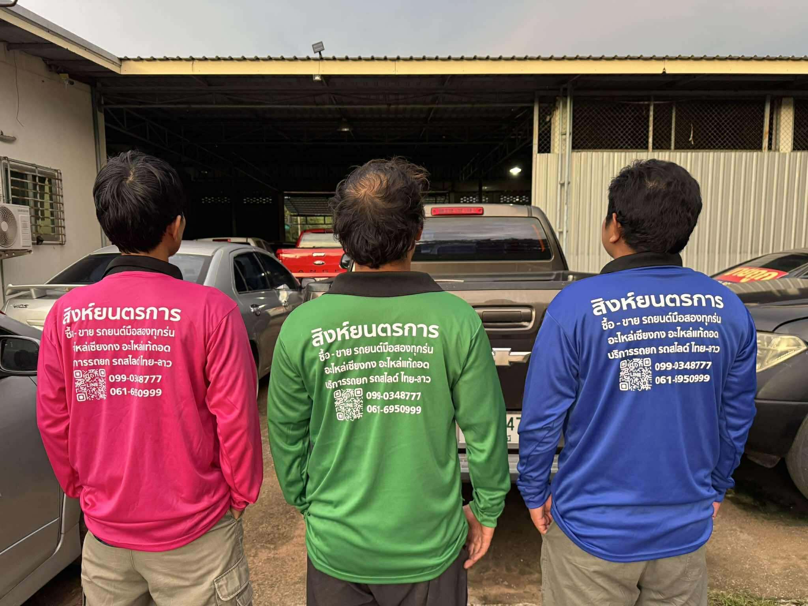
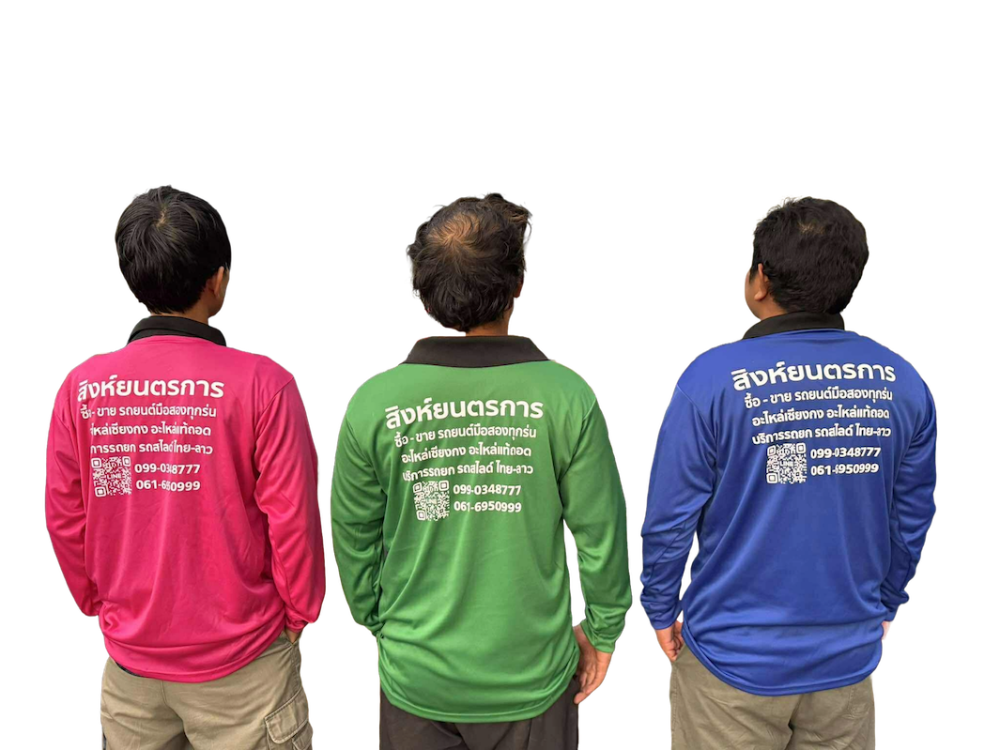

# Background Removal by Adobe Express

**Required**: [Adobe Express](https://www.adobe.com/express/feature/image/remove-background)

เนื่องจากฟีเจอร์ลบแบ็คกราวนด์ของภาพถ่าย(Background Remover)ใน Canva เวอร์ชั่นฟรี นั้นจำกัดให้ดาวน์โหลดภาพแบบแบ็คกราวน์โป่รงใส่ได้แค่ครั้งเดียว  
แต่ไม่เป็นปัญหา เพราะ Adobe Express เปิดให้ใช้งานฟีเจอร์ฟรีแบบง่ายๆสำหรับผู้ใช้ทั่วไป โดยไม่ต้องสมัครสมาชิกหรือเข้าสู่ระบบ
เอาจริงมันลบได้เนียนอยู่นะ ตอนจะดาวน์โหลดลงมาก็เลือกพื้นหลังโปร่งใส (transparent) จะได้ไฟล์ PNG ลงมาใช้ได้เลย

