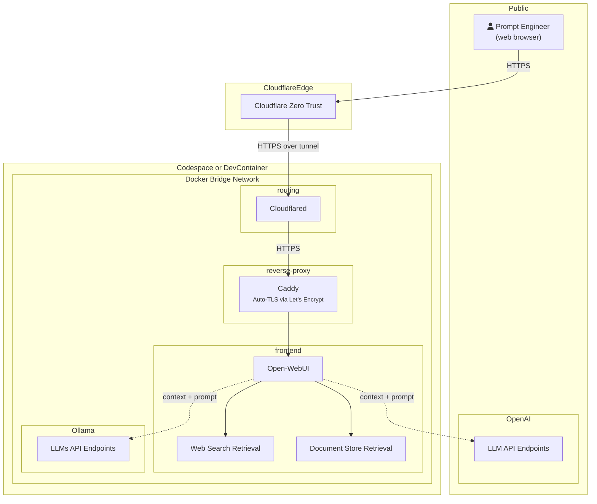

Let's say you are pitching an AI application to VCs for raising funds. Instead of browsing `http://localhost/`, you can have professional Domain Name with CloudFlare. But the application is still running on your development or SIT environment.

:::note Conceptual Diagram
