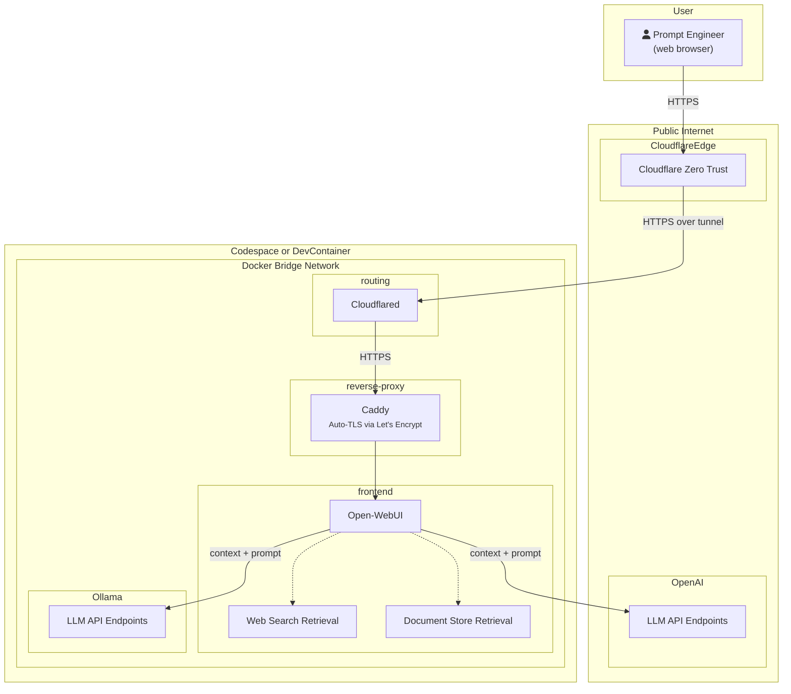

Let's say you are pitching an AI application to VCs for raising funds. Instead of browsing `http://localhost/`, you can have professional Domain Name with CloudFlare. But the application is still running on your development or SIT environment.

:::note Conceptual Diagram

:::
## How-to setup
All of works are defined as a Docker compose.yaml in [this repository](https://github.com/piky/open-webui). What you need to do is just:
### Option 1:
Fork the repo and set required Codespace secrets environment varibales

### Option 2: 
Clone the repo locally then run:
```sh
$ git clone https://github.com/piky/open-webui.git
$ cd open-webui
$ docker compose up -d
```